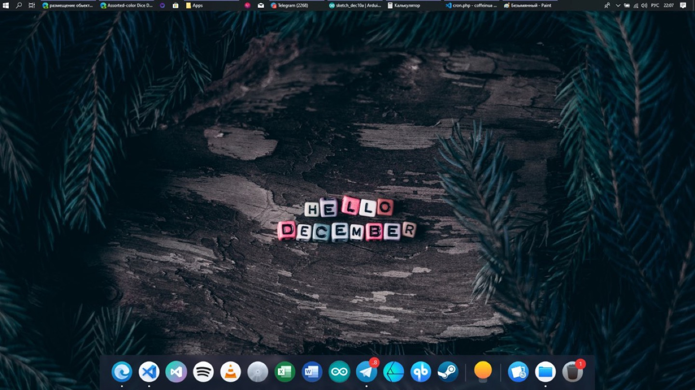

# FoxDock

[-0078D6.svg?logo=windows&logoColor=white)](FoxDock/FoxDock.csproj)

[-orange.svg)](#disclaimer--legacy-notice)

A customizable, macOS-inspired desktop application dock for Windows, built with C# and WPF to bring fluid animations, icon magnification, themeable icon packs, and acrylic blur aesthetics to the Windows desktop.

  

---

> [!WARNING]
> ### Disclaimer & Legacy Notice
> This project was developed between **2019 and 2020** (tested primarily on Windows 10 build 1903/1909) and has **not been maintained or tested since**.
> 
> Because Windows 11 introduced its own centered taskbar and overhauled low-level Win32 shell hooks, window layering APIs, and DWM composition rules, **this application may not function as intended (or at all) on modern Windows 11 environments**. It is preserved here as a historical engineering artifact and open-source portfolio milestone.

---

## 🦊 The Origin Story

Before Windows 11 introduced a modern centered taskbar and sleek Fluent aesthetics, the classic Windows 10 taskbar felt rigid, utilitarian, and visually stagnant.

Longing for the dynamic fluidity, icon hover zoom, and elegance of macOS Dock on a Windows workstation, I set out in 2019 to build **FoxDock**:
- **Win32 Shell & Hook Interop**: Intercepted low-level window events to track active applications and running process state.
- **WPF Smooth Animation Engine**: Custom magnification physics and parabolic zoom curves inspired by macOS.
- **Fluent & Acrylic Glass**: Leveraged `FluentWPF` and `MaterialDesignThemes` to bring modern translucent backdrop effects into the Windows 10 desktop.
- **Modular Icon Packs**: Full support for custom theme packs (`Cupertino`, `Lumicons`, `Shirae Color`, `Windows 10`).
- **Recent Files & Task Switcher**: Interactive popup stacks for quick access to recent media, folders, and system actions.

---

## 🔬 Explorations & Experiments

Historical prototypes and research branches are archived in [`experiments/`](experiments/):
- **`experiments/foxdock-fluent` & `fluent-dock`**: UWP Fluent Design explorations.
- **`experiments/foxdock-neo`**: Standalone state machine refactoring prototype.
- **`iconpack-creator/`**: Dedicated companion tool for packaging custom icon themes.
